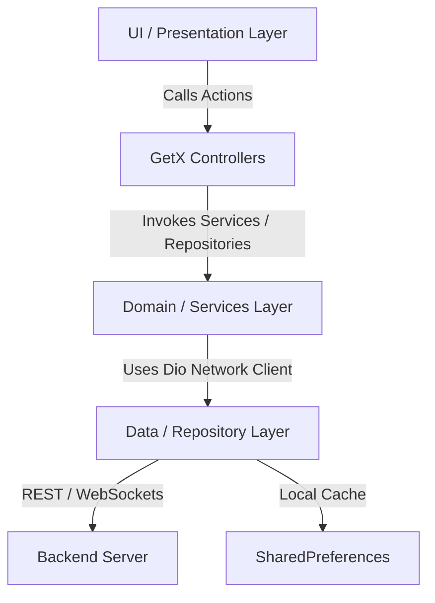

# প্রজেক্ট ওভারভিউ - SMRTSCRUB (tbsosick)

SMRTSCRUB প্রজেক্টের ডকুমেন্টেশন রিপোজিটরি। এই ফাইলে প্রজেক্ট আর্কিটেকচার, রাউটিং, স্টেট ম্যানেজমেন্ট, এপিআই ইন্টিগ্রেশন এবং স্ট্যান্ডার্ড বিল্ড প্রসেস সম্পর্কে বিস্তারিত ধারণা দেওয়া হয়েছে।

---

## ১. প্রজেক্ট আর্কিটেকচার (Project Architecture)

SMRTSCRUB প্রজেক্টে **Clean Architecture / Model-View-Controller (MVC) হাইব্রিড ডিজাইন** ব্যবহার করা হয়েছে এবং এটি **GetX** ফ্রেমওয়ার্কের উপর ভিত্তি করে তৈরি। আর্কিটেকচারটি আলাদা আলাদা লেয়ারে বিভক্ত:



*   **Presentation Layer (UI & Controllers):** এখানে ইউজার ইন্টারফেস স্ক্রিন এবং তাদের নিজস্ব কন্ট্রোলার থাকে। কন্ট্রোলারগুলো লজিক প্রসেস করে, ইউআই স্টেট নিয়ন্ত্রণ করে এবং স্টোরেজ বা নেটওয়ার্কের সাথে কানেক্ট করে।
*   **Domain/Services Layer (GetxService):** এটি অ্যাপ চালুর সময় ইনিশিয়ালাইজ হওয়া ব্যাকগ্রাউন্ড সার্ভিস (যেমন: `AuthService`, `IapService`, `SocketService`) যা পুরো অ্যাপ লাইফসাইকেল জুড়ে সচল থাকে।
*   **Data Layer (Repositories & API Client):** এটি এপিআই ডাটা রিকোয়েস্ট এবং মডেল পার্সিং হ্যান্ডেল করে। এর জন্য সেন্ট্রাল `ApiClient` ব্যবহার করা হয়।

---

## ২. ফোল্ডার স্ট্রাকচার (Folder Structure)

প্রজেক্টের ডিরেক্টরি এবং ফাইলগুলো `lib/` ফোল্ডারের ভেতরে নিচের নিয়মে সাজানো হয়েছে:

```text
lib/
│
├── app.dart                   # রুট উইজেট কনফিগারেশন (GetMaterialApp, থিম, লোকেল সেটিংস)
├── main.dart                  # অ্যাপের মেইন এন্ট্রি পয়েন্ট (সার্ভিসেস ইনিশিয়েলাইজ ও রান করা)
├── firebase_options.dart      # FlutterFire CLI দিয়ে অটো-জেনারেটেড কনফিগারেশন ফাইল
│
├── config/                    # অ্যাপের গ্লোবাল কনফিগারেশন
│   ├── constants/             # সেন্ট্রালাইজড কনস্ট্যান্ট ফাইল
│   │   ├── api_constants.dart # সার্ভার এন্ডপয়েন্ট ও ইউআরএল পাথ
│   │   ├── app_constants.dart # অ্যাপের নাম, ভার্সন, টাইমআউট সেটিংস
│   │   ├── image_paths.dart   # ইমেজ ও এসভিজি অ্যাসেট পাথ
│   │   └── storage_constants.dart # SharedPreferences কি-সমূহ
│   ├── routes/                # অ্যাপ নেভিগেশন রাউট ও পেজ বাইন্ডিং
│   └── themes/                # লাইট ও ডার্ক মোড কালার থিম সেটিংস
│
├── core/                      # অ্যাপের কোর সার্ভিসেস ও হেল্পার ফাইল
│   ├── bindings/              # গ্লোবাল ডিপেন্ডেন্সি ইনজেকশন বাইন্ডিং (InitialBinding)
│   ├── controllers/           # সিস্টেম-ওয়াইড কন্ট্রোলার (ইন্টারনেট, ল্যাঙ্গুয়েজ কন্ট্রোলার)
│   ├── services/              # কোর সার্ভিসেস (Auth, IAP, FCM, লোকাল নোটিফিকেশন, এপিআই ক্লায়েন্ট)
│   └── utils/                 # এক্সটেনশন মেথড, কাস্টম লগার, ভ্যালিডেটর ও অন্যান্য ইউটিলিটি
│
├── data/                      # ডাটা মডেল ও সরাসরি ডাটা সোর্স মেথডস
│   ├── models/                # জেএসওন পার্সিং ডাটা মডেল ক্লাস
│   └── repositories/          # এপিআই রিকোয়েস্ট পাঠানোর জন্য রিপোজিটরি ক্লাসসমূহ
│
└── presentation/              # ইউজার ইন্টারফেস লেয়ার (স্ক্রিন, কন্ট্রোলার ও উইজেটস)
    ├── controllers/           # নির্দিষ্ট পেজের কন্ট্রোলার (Login, SignUp, ResetPassword)
    ├── widgets/               # রিইউজেবল উইজেট (CustomButton, CustomTextField ইত্যাদি)
    └── screens/               # ফিচার অনুযায়ী গ্রুপ করা স্ক্রিন ফোল্ডার (ProfilePage, HomePage, Auth)
```

---

## ৩. স্টেট ম্যানেজমেন্ট (State Management - GetX)

এই প্রজেক্টে স্টেট ম্যানেজমেন্ট, ডিপেন্ডেন্সি ইনজেকশন এবং রাউটিং এর জন্য **GetX** ব্যবহার করা হয়েছে।

*   **Dependency Injection:** `lib/core/bindings/initial_binding.dart` ফাইলের ভেতর `Get.put()` ও `Get.lazyPut()` ব্যবহার করে গ্লোবাল ডিপেন্ডেন্সি ইনজেকশন করা হয়েছে। যেমন `StorageService`, `ApiClient`, `AuthService`, এবং `IapService` চিরস্থায়ীভাবে সচল রাখতে `permanent: true` সেট করা হয়েছে।
*   **UI State Rebinds:** নির্দিষ্ট স্ক্রিনের পেজ কন্ট্রোলারগুলো পেজে ঢোকার সময় অন-ডিমান্ড বাইন্ডিং বা সরাসরি ইনজেক্ট করে মেমরিতে নেওয়া হয়।
*   **Reactivity:** স্টেট হ্যান্ডেল করার জন্য `Rx` টাইপ ডেটা (যেমন: `RxBool`, `RxString`, `RxInt`, `.obs`) এবং ইউআই-তে `Obx` উইজেট ব্যবহার করা হয়েছে। কোনো ভ্যালু পরিবর্তিত হলে শুধুমাত্র ওই নির্দিষ্ট উইজেটটি নতুন করে রেন্ডার হয়।

---

## ৪. এপিআই ও নেটওয়ার্ক লেয়ার (API & Network Layer)

অ্যাপের নেটওয়ার্ক ডাটা আদান-প্রদান **Dio** প্যাকেজের মাধ্যমে করা হয়। এটি `ApiClient` (`lib/core/services/api_client.dart`) ক্লাসের ভেতর সুন্দরভাবে র্যাপ (wrap) করা আছে।

### প্রধান বৈশিষ্ঠ্যসমূহ
*   **Base Configuration:** ডিফল্ট কানেকশন সেটিংস যেমন `baseUrl` (`https://api.smrtscrub.app/api/v1`), `connectTimeout` এবং `receiveTimeout` (৩০ সেকেন্ড) কনফিগার করা আছে।
*   **Interceptors:** সকল অথেন্টিকেটেড রিকোয়েস্টে `StorageService` থেকে `bearerToken` রিড করে `Authorization: Bearer <token>` হেডার অটো-ইনজেক্ট করা হয়।
*   **Token Refresh:** এপিআই রিকোয়েস্টে `401 Unauthorized` রেসপন্স আসলে, ইন্টারসেপ্টর অটোমেটিক রিফ্রেশ টোকেন এন্ডপয়েন্ট কল করে নতুন অ্যাক্সেস টোকেন জেনারেট করে লোকাল স্টোরেজে সেভ করে এবং ব্যর্থ রিকোয়েস্টটি পুনরায় পাঠায়।
*   **Error Logging:** কানেকশন ইরর, টাইমআউট এবং সার্ভার এরর কনসোল লগে ফরম্যাট করে দেখায় যাতে অ্যাপ ক্র্যাশ না করে।

---

## ৫. অ্যাপের মূল প্রবাহসমূহ (Main Flows)

### ক. অথেন্টিকেশন ফ্লো (Authentication Flow)
```
[Login Screen] ──> ইমেইল/পাসওয়ার্ড বা গুগল/অ্যাপল দিয়ে সাইন-ইন ট্রিগার
      │
      ├──> AuthService কল করা (signInWithGoogle / signInWithApple / emailLogin)
      ├──> সোশ্যাল অথেনটিকেশনে এসডিকে থেকে টোকেন জেনারেট করা
      ├──> AuthService থেকে AuthRepository.socialLogin() অথবা login() কল
      ├──> সার্ভার এপিআই থেকে JWT টোকেন (AccessToken + RefreshToken) ও প্রোফাইল ডাটা ব্যাক করা
      ├──> টোকেন ও ইউজার আইডি StorageService-এ সেভ করা
      └──> রাউটারের মাধ্যমে HomePage-এ নেভিগেট করা
```

### খ. নোটিফিকেশন ফ্লো (Notification Flow)
```
[Backend Server] ──> Firebase Cloud Messaging (FCM) এর মাধ্যমে পে-লোড পাঠানো
      │
      ├──> অ্যাপ ফোরগ্রাউন্ডে থাকলে: FirebaseNotificationService.onMessage ইন্টারসেপ্টর ট্রিগার হয়
      │    └──> ব্যাকেন্ড থেকে নোটিফিকেশন রিলোড করে (/notifications/me)
      │    └──> NotificationService.showPushNotification() দিয়ে লোকাল ব্যানার দেখায়
      │
      └──> অ্যাপ ব্যাকগ্রাউন্ডে/বন্ধ থাকলে: সিস্টেম সরাসরি নেটিভ নোটিফিকেশন ব্যানার দেখায়
           └──> ক্লিক করলে: onMessageOpenedApp সচল হয় এবং onNotificationTap হ্যান্ডলার ফায়ার করে
```

### গ. সাবস্ক্রিপশন ফ্লো (Subscription Flow)
```
[Subscription Page] ──> অ্যাপ স্টোর / গুগল প্লে থেকে একটিভ প্রোডাক্ট লিস্ট নিয়ে আসা
      │
      ├──> ইউজার প্ল্যান সিলেক্ট করে IapService.buySubscription() ট্রিগার করা
      ├──> IapService লোকাল UserId থেকে একটি ক্রিপ্টোগ্রাফিক Buyer Token (UUIDv5) তৈরি করে
      ├──> অ্যাপ স্টোর / গুগল প্লে এর পেমেন্ট শীট ওপেন এবং পেমেন্ট সম্পন্ন করা
      ├──> সাকসেস স্ট্রিম থেকে ট্রানজেকশন কি রিড করা
      ├──> সার্ভারের ভেরিফাই এন্ডপয়েন্টে ভেরিফিকেশন টোকেন পোস্ট করা
      ├──> ব্যাকেন্ড সার্ভার সরাসরি অ্যাপল/গুগল এপিআই কল করে পেমেন্ট ভেরিফাই করা
      └──> ভেরিফিকেশন সফল হলে: completePurchase() কল দিয়ে ট্রানজেকশন ক্লোজ করা ও ইউআই আপডেট করা
```

---

## ৬. রিলিজ প্রসেস (Release Process)

### অ্যান্ড্রয়েড রিলিজ প্রসেস (Android Release)
১. `pubspec.yaml` ফাইলে ভার্সন নেম ও কোড আপডেট করুন (যেমন: `version: 1.0.0+3`)।
২. টার্মিনালে `flutter clean` এবং `flutter pub get` রান করুন।
৩. অ্যাপ বান্ডেল তৈরি করতে রান করুন:
   ```bash
   flutter build appbundle
   ```
৪. জেনারেট হওয়া ফাইল `build/app/outputs/bundle/release/app-release.aab` ফাইলটি **Google Play Console**-এ আপলোড করুন।

### আইওএস রিলিজ প্রসেস (iOS Release)
১. `pubspec.yaml` ফাইলে ভার্সন নেম ও বিল্ড কোড আপডেট করুন।
২. টার্মিনালে `flutter clean` এবং `flutter pub get` রান করুন।
৩. আইওএস আর্কাইভ জেনারেট করতে রান করুন:
   ```bash
   flutter build ipa
   ```
৪. তৈরি হওয়া বিল্ডটি **Xcode** দিয়ে ওপেন করে টিম সিলেক্ট করুন এবং **App Store Connect / TestFlight**-এ সাবমিট করুন।
